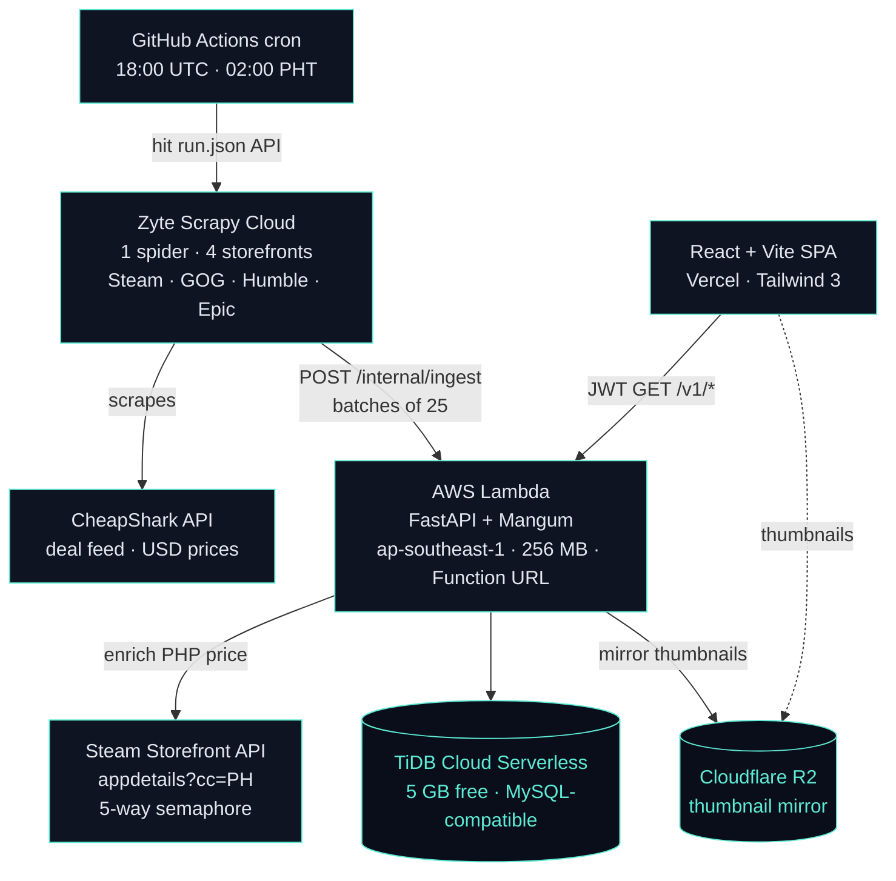
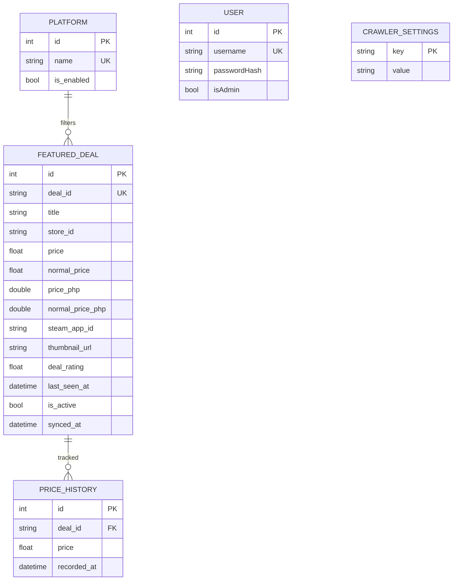
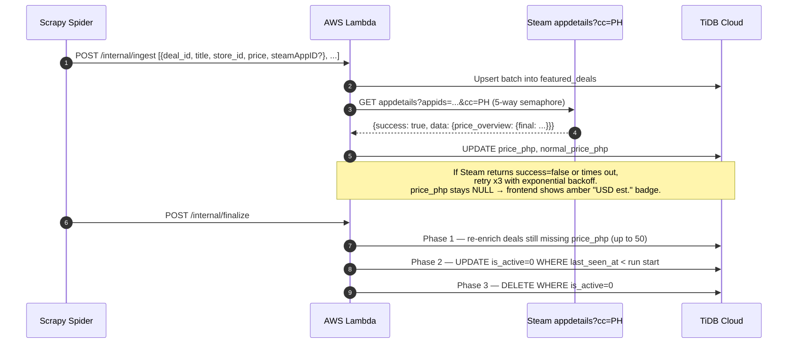
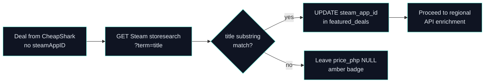

# Judgement Cut

> A daily-refreshing dashboard of game deals across **Steam**, **GOG**, **Humble**, and **Epic** — with **native Steam Philippine peso pricing** so the numbers match what you actually pay.

Judgement Cut was built for personal use and designed to cost **$0/month forever**. CheapShark feeds the deal stream, Steam's regional API resolves native PHP prices, Zyte Scrapy Cloud runs the daily crawl at 02:00 PHT, and AWS Lambda + TiDB Cloud + Cloudflare R2 handle enrichment, persistence, and asset storage — all on perpetual free tiers.

Frontend is a React/Vite SPA on Vercel. Backend is a FastAPI app behind a Lambda Function URL (no API Gateway). The spider is a single Scrapy project deployed to Zyte Scrapy Cloud and triggered by a GitHub Actions cron.

---

## Live Demo

- **Live app:** https://judgement-cut.vercel.app/
- **Backend:** AWS Lambda Function URL (`ap-southeast-1`)
- **Scheduler:** GitHub Actions cron fires daily at 18:00 UTC (02:00 PHT), triggers Zyte spider via `run.json` API

> Cold start may take 1–2 seconds on first request; subsequent requests are warm.

---

## Table of Contents

1. [What It Does](#what-it-does)
2. [Architecture](#architecture)
3. [Tech Stack](#tech-stack)
4. [Database Design](#database-design)
5. [Repository Layout](#repository-layout)
6. [API Reference](#api-reference)
7. [Pricing Accuracy Flow](#pricing-accuracy-flow)
8. [Deployment & Environment Variables](#deployment--environment-variables)
9. [Cost Breakdown](#cost-breakdown)
10. [Local Development](#local-development)
11. [Author](#author)

---

## What It Does

- **Crawls 4 storefronts daily** at 02:00 PHT — Steam (~480 deals, `steamRating ≥ 70`), GOG (top 60), Humble (top 60), and Epic (free games only).
- **Native Steam PH pricing** — queries `store.steampowered.com/api/appdetails?cc=PH` directly so prices match Steam's checkout page exactly, not a USD × FX approximation.
- **Title-search fallback** — if CheapShark doesn't include `steamAppID` for a deal, we search Steam's `storesearch` API by title to recover it and persist the ID so subsequent runs skip the lookup.
- **Honest pricing badges** — green "Steam PH price" when we have native PHP, amber "USD est." when we fall back to FX conversion via open.er-api.com (24h cached).
- **Price history per deal** with all-time-low tracking. History rows survive `featured_deals` deletes so lookups stay valid across crawl rotations.
- **Admin panel** — platform toggles, user management, scraper heartbeat monitor.
- **Lambda-frugal batched ingest** — spider POSTs to `/internal/ingest` in batches of 25. That cuts Lambda invocations to ~900/month against a 1M free-tier limit.

---

## Architecture



### Notable architectural choices

- **No API Gateway.** The Lambda exposes a Function URL directly. API Gateway has its own pricing tier after the 12-month new-account free window; Function URLs are free indefinitely.
- **5-way parallel Steam enrichment with a semaphore.** Resolving PHP prices for ~480 Steam deals in series would be unbearably slow and would burn Lambda compute time. A `asyncio.Semaphore(5)` keeps concurrent regional API calls within Steam's rate tolerance while finishing the full enrichment pass in seconds, not minutes.
- **3-phase finalize at end of every crawl.** After ingest the spider calls `/internal/finalize`: Phase 1 re-enriches up to 50 deals still missing `price_php`, Phase 2 marks deals not seen this run as `is_active = 0`, Phase 3 deletes all inactive rows. This keeps `featured_deals` row count exactly equal to the current crawl, no accumulation of stale data.
- **Title-search fallback.** A small fraction of CheapShark deals have no `steamAppID`. Instead of silently omitting PHP pricing, we search Steam's `storesearch` endpoint by title and persist the recovered ID so subsequent runs skip the lookup entirely.
- **GitHub Actions cron instead of Scrapy Cloud Periodic Jobs.** Periodic Jobs is a paid Scrapy Cloud feature. The cron workflow just hits Zyte's `run.json` REST endpoint with the API key — free for public repos, and uses about 1 minute of the 2,000 minute/month allowance.
- **TiDB Cloud over RDS.** RDS's free tier expires after 12 months. TiDB Cloud's 5 GB serverless tier is perpetual and MySQL-compatible, so the SQLAlchemy / PyMySQL stack works unchanged.

---

## Tech Stack

### Spider

| Layer | Technology | Why |
|-------|-----------|-----|
| Framework | Scrapy | Mature, pipeline-based, Zyte-native |
| Hosting | Zyte Scrapy Cloud | Free tier, rotating IPs, no Cloudflare bot battles |
| Scheduler | GitHub Actions cron (`run-spider-daily.yml`) | Free; bypasses paid Scrapy Cloud Periodic Jobs |
| Ingest target | `POST /internal/ingest` on Lambda | Batched 25-item payloads, `X-Scraper-Secret` header auth |

### Backend

| Layer | Technology | Why |
|-------|-----------|-----|
| Runtime | Python 3.11 | Latest stable on Lambda `python3.11` runtime |
| Framework | FastAPI | Async, typed, automatic OpenAPI |
| ASGI adapter | Mangum | Wraps FastAPI for Lambda Function URL invocations |
| HTTP client | httpx[http2] | Async, used for Steam regional API enrichment |
| Database driver | aiomysql + pymysql + SQLAlchemy | Async queries + sync fallback; TiDB Cloud is MySQL-compatible |
| Auth | python-jose (JWT) + passlib[bcrypt] | Signed short-lived access tokens; bcrypt hashing |
| Cloud storage | boto3 (Cloudflare R2 via S3-compatible API) | Thumbnail mirror, zero egress cost |
| Config | python-dotenv | `.env` for local, Lambda env vars for prod |

### Frontend

| Layer | Technology | Why |
|-------|-----------|-----|
| Framework | React 18 | Component model, hooks |
| Build | Vite 5 | Sub-second HMR |
| Styling | Tailwind CSS 3 | Utility-first |
| Routing | react-router-dom 6 | Nested layouts, route guards |
| HTTP | fetch (native) | No axios overhead needed at this scope |
| Hosting | Vercel | Hobby tier free, global CDN, automatic deploys |

---

## Database Design

Five tables on TiDB Cloud Serverless. `featured_deals` is wiped to the latest crawl on every spider run via the 3-phase finalize step.



### Table: `featured_deals`

Active deals shown on the dashboard. Wiped to the latest crawl on every run.

| Column | Type | Notes |
|--------|------|-------|
| `deal_id` | VARCHAR(100) UNIQUE | CheapShark dealID, primary lookup key |
| `title` | VARCHAR(300) | game name |
| `store_id` | VARCHAR(50) | `"1"`=Steam, `"7"`=GOG, `"11"`=Humble, `"25"`=Epic |
| `price` / `normal_price` | FLOAT | USD prices from CheapShark |
| `price_php` / `normal_price_php` | DOUBLE | native Steam PH prices when available; `NULL` triggers amber badge on frontend |
| `regional_price_at` | DATETIME | when PHP pricing was last fetched |
| `steam_app_id` | VARCHAR(50) | recovered via title-search if CheapShark didn't provide |
| `thumbnail_url` | VARCHAR(500) | CheapShark cover-art URL (R2 mirror is lazy) |
| `deal_rating` | FLOAT | CheapShark's score, used for sorting |
| `last_seen_at` | DATETIME | `NOW()` on every ingest |
| `is_active` | TINYINT(1) | flipped to `0` by finalize Phase 2, deleted in Phase 3 |
| `synced_at` | DATETIME | last upsert time |

### Table: `price_history`

Every observed price for every deal. Survives `featured_deals` deletions so historical lookups keep working.

| Column | Type | Notes |
|--------|------|-------|
| `deal_id` | VARCHAR(100) | foreign reference (no FK constraint — intentional) |
| `price` | FLOAT | USD price at time of observation |
| `recorded_at` | DATETIME | observation time |

### Other tables

| Table | Purpose |
|-------|---------|
| `users` | Admin accounts — `username`, `passwordHash` (bcrypt), `isAdmin` flag |
| `platforms` | Per-storefront `is_enabled` toggle; admin panel reads/writes this |
| `crawler_settings` | Key-value store for scraper health heartbeat and config |

---

## Repository Layout

```
judgement-cut/
├── .github/workflows/
│   ├── deploy-lambda.yml        # Package + deploy FastAPI Lambda (ap-southeast-1)
│   ├── deploy-spider.yml        # Push Scrapy project to Zyte Scrapy Cloud
│   └── run-spider-daily.yml     # Cron 18:00 UTC → hit Zyte run.json API
├── backend/
│   ├── requirements.txt         # fastapi, mangum, httpx, aiomysql, pymysql,
│   │                            # passlib[bcrypt], python-jose, boto3, python-dotenv
│   ├── .env.example             # All required env vars with descriptions
│   ├── function.zip             # Pre-built Lambda deployment artifact
│   └── src/
│       ├── handler.py           # Lambda entrypoint → Mangum(app)
│       ├── main.py              # Re-export shim
│       └── app/
│           ├── main.py          # FastAPI app, CORS, router mounts
│           ├── db.py            # SQLAlchemy engine + session factory (TiDB SSL-aware)
│           ├── api/
│           │   ├── auth.py      # POST /auth/login, /auth/register
│           │   ├── deals.py     # GET /v1/deals (paginated, filtered)
│           │   ├── internal.py  # POST /internal/ingest, /internal/finalize
│           │   ├── dependencies.py  # JWT bearer dependency
│           │   └── v1/
│           │       ├── user_routes.py   # User management (admin-gated)
│           │       └── admin_routes.py  # Platform toggles, settings, heartbeat
│           ├── clients/
│           │   └── cheapshark.py        # CheapShark HTTP client
│           ├── core/
│           │   ├── config.py            # Pydantic Settings (env + .env)
│           │   ├── security.py          # JWT encode/decode, bcrypt helpers
│           │   └── services/
│           │       ├── cheapshark.py    # Deal fetch logic
│           │       ├── deals_service.py # Upsert + history tracking
│           │       └── steam_pricing.py # Regional API enrichment + semaphore
│           ├── data/
│           │   ├── models.py            # SQLAlchemy ORM models
│           │   ├── storage.py           # Cloudflare R2 (boto3, S3-compatible)
│           │   └── repositories/
│           │       ├── deals_repo.py    # CRUD + finalize phases
│           │       ├── price_history_repo.py
│           │       ├── platforms_repo.py
│           │       └── crawler_repo.py  # Heartbeat read/write
│           └── schemas/
│               └── user.py              # Pydantic request/response models
├── scrapers/
│   ├── scrapy.cfg
│   ├── scrapinghub.yml          # Zyte project ID
│   ├── requirements.txt         # scrapy (minimal — runs on Zyte's Python env)
│   ├── setup.py
│   ├── .env.example
│   └── scrapers/
│       ├── items.py             # DealItem schema
│       ├── settings.py          # Spider settings, pipeline order
│       ├── pipelines.py         # Batch pipeline → POST /internal/ingest
│       └── spiders/
│           └── games_spider.py  # 4-storefront spider (Steam/GOG/Humble/Epic)
└── frontend/
    ├── package.json             # React 18, Vite 5, Tailwind 3
    ├── vite.config.js
    ├── vercel.json
    └── src/
        ├── App.jsx              # All routes + page components (monolithic SPA)
        ├── main.jsx
        ├── index.css            # Tailwind directives + custom theme
        ├── lib/
        │   ├── api.js           # Typed API client, JWT attach
        │   └── security.js      # Token storage helpers
        └── assets/
            └── JudgementCut_Logo.png
```

---

## API Reference

All `/v1/*` and `/auth/*` routes go through the Lambda Function URL. Internal routes are gated by `X-Scraper-Secret`.

### Auth

| Method | Path | Auth | Purpose |
|--------|------|------|---------|
| POST | `/auth/login` | none | Username + password → JWT access token |
| POST | `/auth/register` | none | Create admin account (first-run / seeded use) |

### Deals

| Method | Path | Auth | Purpose |
|--------|------|------|---------|
| GET | `/v1/deals` | JWT | Paginated, filterable deal list with PHP prices |

### Admin

| Method | Path | Auth | Purpose |
|--------|------|------|---------|
| GET | `/v1/admin/users` | JWT (admin) | List users |
| POST | `/v1/admin/users` | JWT (admin) | Create user |
| PATCH | `/v1/admin/users/:id` | JWT (admin) | Update user |
| DELETE | `/v1/admin/users/:id` | JWT (admin) | Delete user |
| GET | `/v1/admin/platforms` | JWT (admin) | List platform toggles |
| PATCH | `/v1/admin/platforms/:id` | JWT (admin) | Enable / disable a storefront |
| GET | `/v1/admin/crawler` | JWT (admin) | Heartbeat + last-run metadata |

### Internal (spider → Lambda)

| Method | Path | Auth | Purpose |
|--------|------|------|---------|
| POST | `/internal/ingest` | `X-Scraper-Secret` | Upsert a batch of 25 deals, enrich PHP prices |
| POST | `/internal/finalize` | `X-Scraper-Secret` | 3-phase crawl finalization |

---

## Pricing Accuracy Flow



### Title-search fallback



---

## Deployment & Environment Variables

Two GitHub Actions workflows handle deployment:

- **`deploy-lambda.yml`** — zips `backend/src/` + installed deps into `function.zip`, deploys to Lambda (`judgement-cut-api`), updates the function configuration.
- **`deploy-spider.yml`** — pushes `scrapers/` to Zyte Scrapy Cloud via `shub deploy`.
- **`run-spider-daily.yml`** — cron `0 18 * * *` (18:00 UTC = 02:00 PHT) hits Zyte's `run.json` endpoint to queue a spider job.

### Backend environment variables (`backend/.env.example`)

| Variable | Default | Purpose |
|----------|---------|---------|
| `DATABASE_URL` | — | Full SQLAlchemy URL for TiDB (or any MySQL) |
| `DB_HOST` / `DB_PORT` | — / `4000` | TiDB Cloud host + port |
| `DB_USERNAME` / `DB_PASSWORD` / `DB_NAME` | — | TiDB credentials |
| `DB_SSL` | auto for `*.tidbcloud.com` | Force SSL (`1`) |
| `JWT_SECRET` | — | Long random secret for signing tokens |
| `ACCESS_TOKEN_EXPIRE_MINUTES` | `60` | Token lifetime |
| `JWT_ALGORITHM` | `HS256` | Signing algorithm |
| `CHEAPSHARK_BASE` | `https://www.cheapshark.com/api/1.0` | CheapShark API base |
| `R2_ACCOUNT_ID` / `R2_ACCESS_KEY` / `R2_SECRET_KEY` / `R2_BUCKET` | — | Cloudflare R2 credentials |
| `R2_ENDPOINT` | `https://{R2_ACCOUNT_ID}.r2.cloudflarestorage.com` | R2 S3-compatible endpoint |
| `SCRAPER_SECRET` | — | Shared secret between spider pipeline and `/internal/*` routes |

### CI secrets required

| Secret | Used by |
|--------|---------|
| `AWS_ACCESS_KEY_ID` / `AWS_SECRET_ACCESS_KEY` | `deploy-lambda.yml` |
| `SHUB_API_KEY` | `deploy-spider.yml` + `run-spider-daily.yml` (Zyte API key) |
| `SHUB_PROJECT_ID` | `deploy-spider.yml` (Zyte project ID) |

---

## Cost Breakdown

Designed for **$0/month forever** — every layer runs on a perpetual free tier.

| Service | Free tier | We use | Headroom |
|---------|-----------|--------|----------|
| AWS Lambda | 1M invocations/mo + 400K GB-s | ~900 invocations | 99.9% |
| AWS Lambda compute | 400K GB-s/mo | ~10K GB-s | 97.5% |
| TiDB Cloud Serverless | 5 GB storage (perpetual) | <100 MB | 98% |
| Cloudflare R2 | 10 GB / 10M ops/mo, zero egress | <1 GB | 90%+ |
| GitHub Actions | 2,000 min/mo (private) / unlimited (public) | ~1 min | 99.9% |
| Zyte Scrapy Cloud | 1 free spider, daily run | 1 spider | within limits |
| CheapShark / Steam / Epic APIs | unlimited public | ~1,500 calls/day | within limits |
| Vercel Hobby | 100 GB bandwidth, unlimited deploys | <1 GB/mo | 99% |

**Monthly total: $0/month**

**Why each free tier was chosen:**

- **Zyte Scrapy Cloud over self-hosted scrapers** — rotating IPs included, no Cloudflare bot-protection battles; the free tier covers one daily crawl cleanly.
- **TiDB Cloud over RDS / Aurora** — RDS free tier expires after 12 months; TiDB Cloud's 5 GB serverless tier is perpetual and MySQL-compatible.
- **R2 over S3** — S3 charges per-GB egress; R2 is zero egress, which matters when thumbnail URLs are served directly to the frontend.
- **GitHub Actions cron over Scrapy Cloud Periodic Jobs** — Periodic Jobs is a paid Scrapy Cloud feature; Actions cron is free and just hits Zyte's REST endpoint.
- **Lambda Function URL over API Gateway** — Function URLs are free; API Gateway has its own pricing tier after the 12-month new-account window.

---

## Local Development

```bash
# Backend
cd backend
python -m venv .venv && source .venv/bin/activate
pip install -r requirements.txt
cp .env.example .env        # fill in TiDB, R2, JWT_SECRET, SCRAPER_SECRET
uvicorn src.app.main:app --reload --port 8000

# Spider (local test run — skips Zyte, hits your local/dev Lambda)
cd scrapers
pip install scrapy
# Set BACKEND_URL and SCRAPER_SECRET in scrapers/.env
scrapy crawl games

# Frontend
cd frontend
npm install
npm run dev    # Vite dev server at :5173
```

The frontend expects `VITE_API_URL` to point at the Lambda Function URL (or `http://localhost:8000` for local dev). The `X-Scraper-Secret` header value must match what the Lambda has in `SCRAPER_SECRET` for `/internal/*` routes to accept spider payloads.

---

## Author

**Ralph Kenneth Sonio** — Cloud-Native Backend & QA Engineer
[Portfolio](https://asciente-portfolio.vercel.app) · [GitHub](https://github.com/Asciente-rks)
